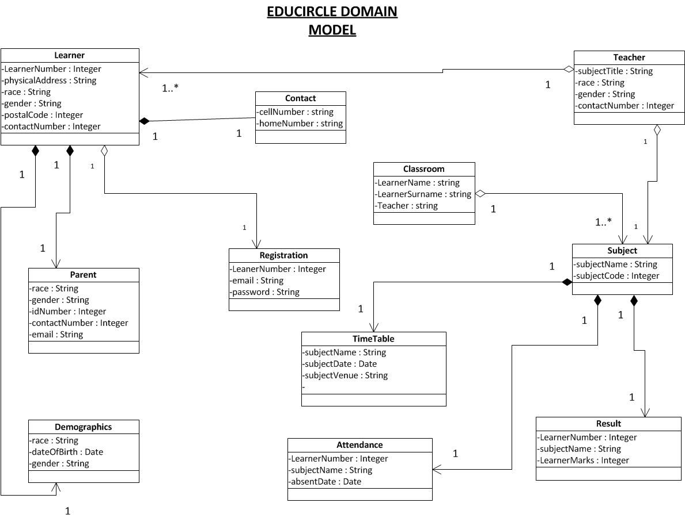

# Project Title   :  Welcome to "eduCircle"

## Background and Problem Description   
Our nation is rapidly deteriorating in the education sector at primary and secondary school levels. Learners from primary and secondary schools don't know how to read, write or speak any language properly.In South Africa for the pass 3 years 90% of the learners in all grades did not pass their subjects and remain in a grade for two years or more.We are facing an enormous problem on a big scale and our authorities have lowered the passing grade to 30% to remedy the situation thus creating irrepairable damage to our future leaders. Our Education department have also introduced a rather sockingly law that states that a learner cannot fail twice and must progress to the next grade regardless of whether that learner pass or fail the second time around. What are we doing to our society and future? 
The parents and the teachers have the power to "RESCUE THE SITUATION" by engaging on a regular basis regarding a learners progress and status.The parents need to take action to rescue our young generation that are slipping away to a point of no return 

#####"Thus comes the birth of this app Called the ""EDUCIRCLE""

When a student register for the first time at a school the learner’s id no are used to register on the application along with his/her parent’s id-no and with the parent’s email address. 
The learners of grade 8 and 9 wil not have the option to choose his/her subjects and will be allocated the default subjects. Learners from grade 10 and higher will have the option to select their subjects and with each and every subject choice there will be a teacher assigned.
If a learner does not attend a subject the teacher of that subject can then enquire from the parent on the whereabouts of the learner in question about the learner's non-attendance.
If a learner's class tests,POE’s (portfolio of evidence) and exam results are not up to standard the teacher can notify the learner’s parent about their child’s academic performance via the application. Exam timetables will also be available on a link on the application based on the learner's subject choice.
There will also be a link to inform the parents on the latest events happening at the school like school concerts, parent meeting, carnivals, camping trips etc. 
The app will allow the parents and teachers to converse immediately regarding the learner at the school.

Hold down the (Ctrl) button and Press the (+) to enlarge the screen to get a better view on the image 

Lets do everything in our power to equip the generation of Tommorrow.
